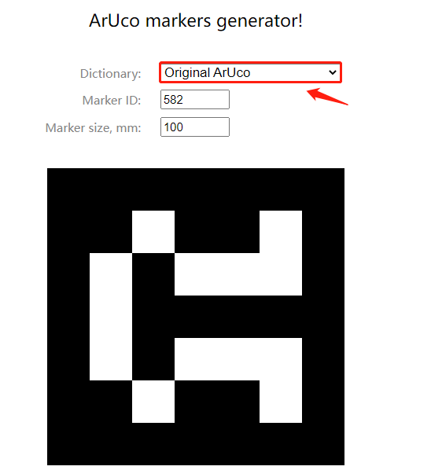

# UTRA ROS 视觉
本工程是提供utra ros的机器视觉例子，
# 开始前准备
1. 英特尔Intel RealSense D435i深度相机，请安装相应驱动及相机ROS工程，[官方地址](https://github.com/IntelRealSense/realsense-ros)
2. 安装aruco_ros, [官方地址](https://github.com/pal-robotics/aruco_ros)
3. 安装easy_handeye， [官方地址](https://github.com/IFL-CAMP/easy_handeye)

# 打印标定图

1. 可以使用工程给出的标定图，doc/img/marker582_5cm.jpg

 

2. 也可以在网上生成你自己的图标，[网址](https://chev.me/arucogen/).记得规格选择 ***Original ArUco***

 

# 外参标定

## 手眼分离外参标定

1.  把标定纸贴到机械臂末端
2.  通过studio使能机械臂
3.  运行launch文件
修改launch->eye_calibrate.launch里面的参数

```
    <arg name="utra_ip"  default="192.168.1.16"/>
    <arg name="utra_type"  default="850"/> <!--550 850 1000-->

    <arg name="marker_size" doc="Size of the ArUco marker used, in meters" default="0.096" /> <!--unit is meter-->
    <arg name="marker_id" doc="The ID of the ArUco marker used" default="582"/>


    找到eye_on_hand标签，根据眼在手上或者外置来标定眼的位置
    <!-- eye-in-hand is true -->
    <!-- eye_on_hand is false -->
    <arg name="eye_on_hand" value="true" />
```

运行
提示：可以使用拖动示教来手动设置机械臂的17个pose,这样来完成手眼标定计算
```
roslaunch utra_ros_visual  eye_calibrate.launch
```