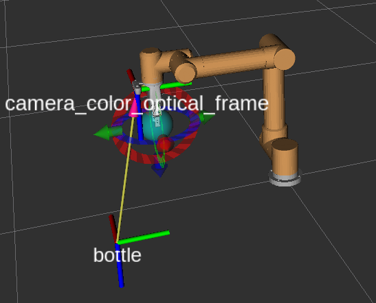
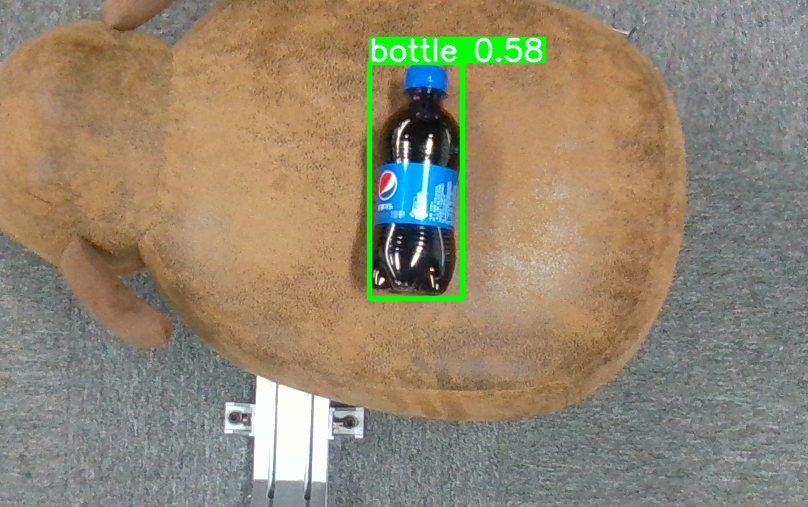
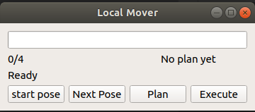

# UTRA ROS VISUAL

This project is the ros visual demo based on Intel RealSense D435i depth camera with eye-on-hand configuration( the calibration file based on the camera bracket of umbratek)

# Preparations before using this package

utra_ros: <https://github.com/UmbraTek/utra_ros>

realsense-ros: <https://github.com/IntelRealSense/realsense-ros>  

easy_handeye: <https://github.com/IFL-CAMP/easy_handeye>

aruco_ros: <https://github.com/pal-robotics/aruco_ros>  


###  Add the d435i model 
for example with Utra 850

utra_ros/utra_description/utra6_850_robot.urdf.xacro
```
<xacro:arg name="add_realsense_d435i" default="true"/> 
```
utra_ros/utra_description/utra6_850_robot_gripper.urdf.xacro
```
<xacro:arg name="add_realsense_d435i" default="true"/> 
```


# 1 Connect Utra

Connect Utra and open the rviz
, you need to setup the `utra_ip` in /launch/start_utra.launch
```
roslaunch utra_ros_visual start_utra.launch
```
 

# 2 Start pubish target tf
Start pubish target tf node
```
roslaunch utra_ros_visual publish_tf.launch
```

# 3 Open the yolov5 detect target
Open the yolov5 detect target, **you sure pip3 install the utra_ros_visual/scripts/yolov5_ros/requirements**
```
python3 utra_ros_visual/scripts/detect.py
```
 

# 4 Open the GUI to graspe
Open the GUI to graspe the target one by one,**the best target for  cola bottle**
```
roslaunch utra_ros_visual grasp.launch
```
 